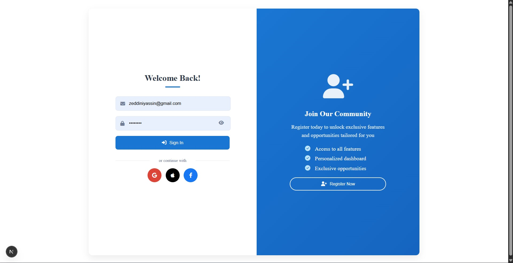
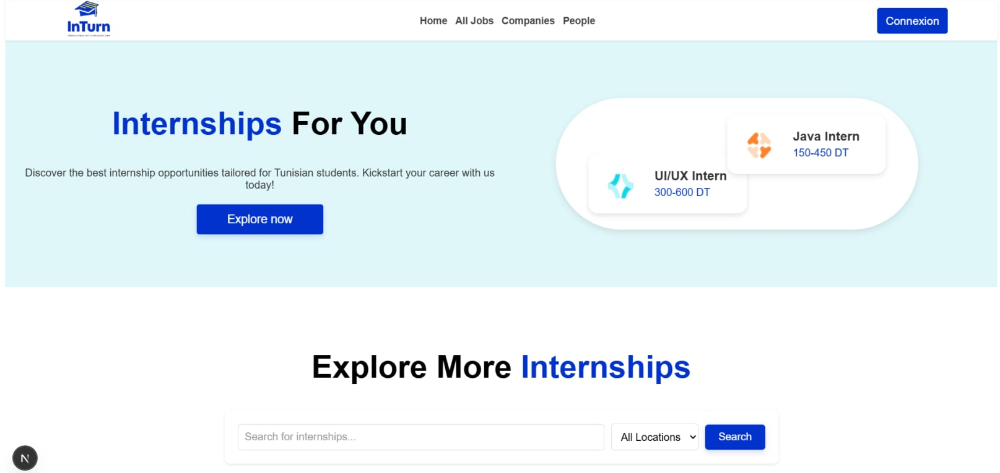
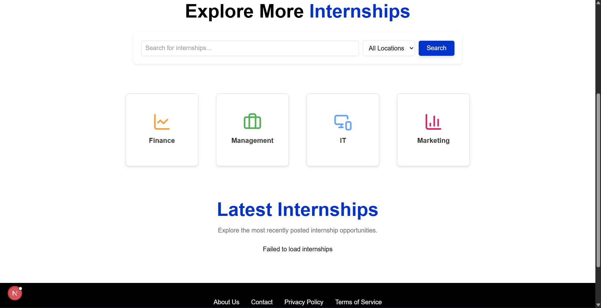
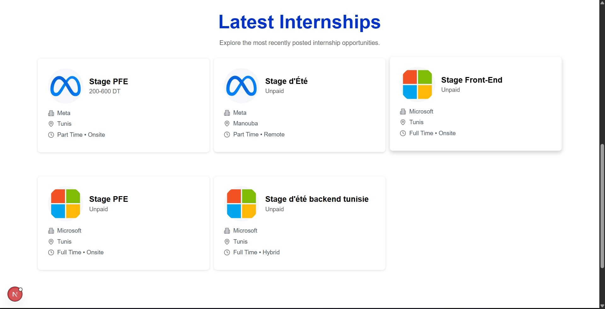
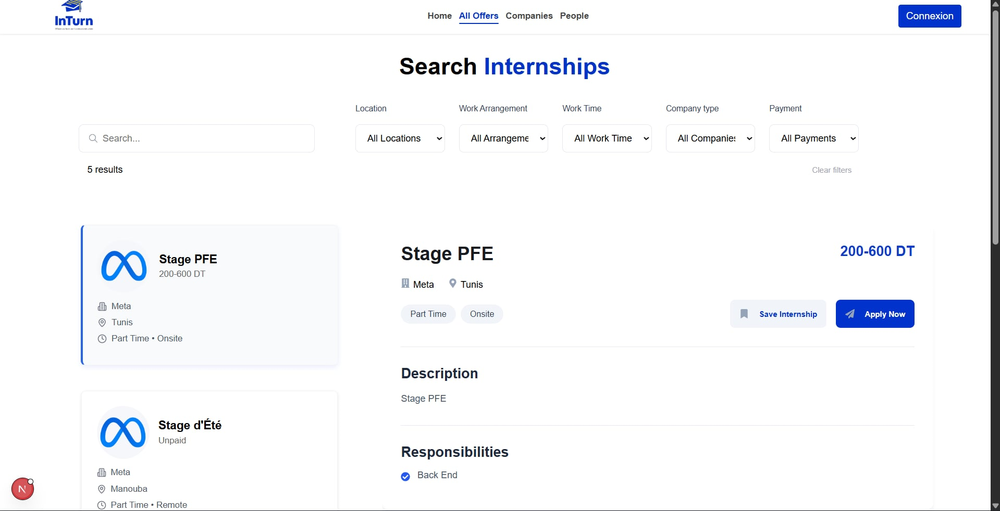
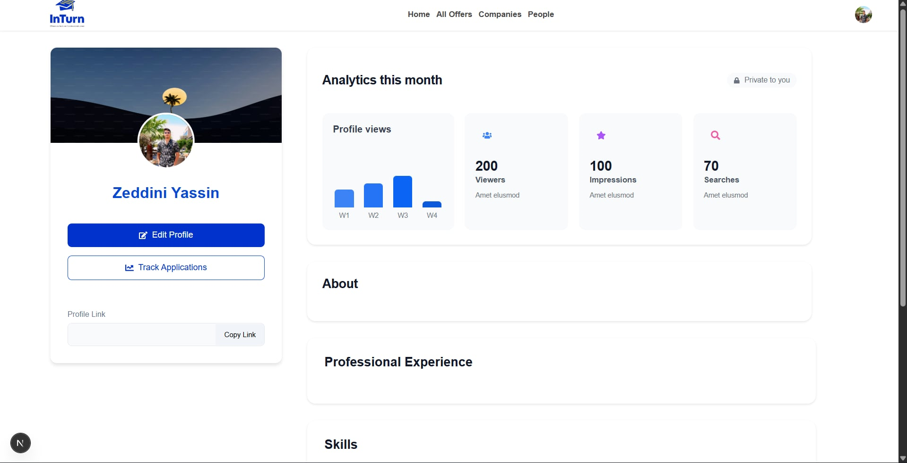
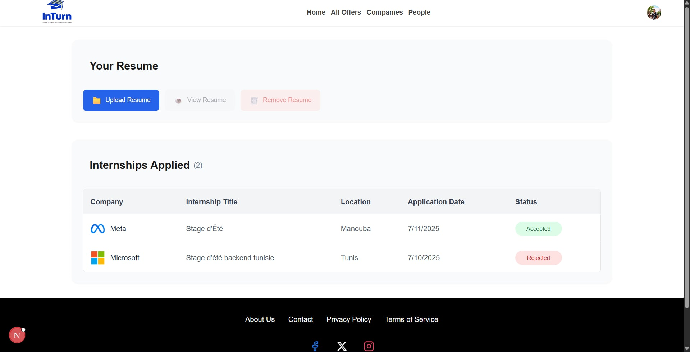
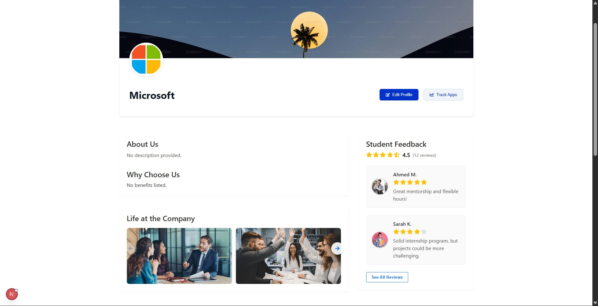
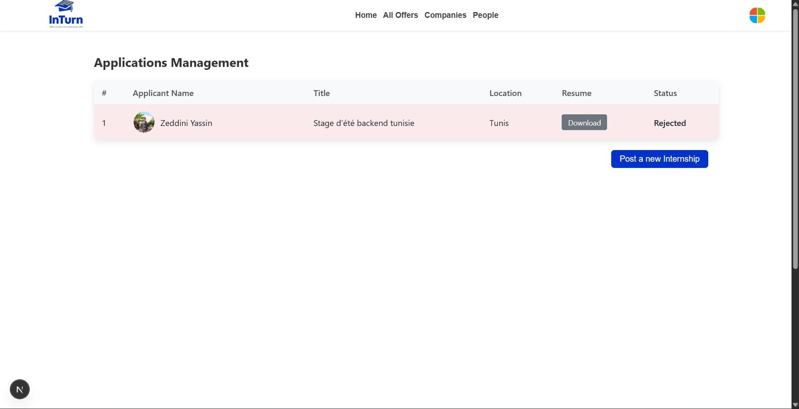
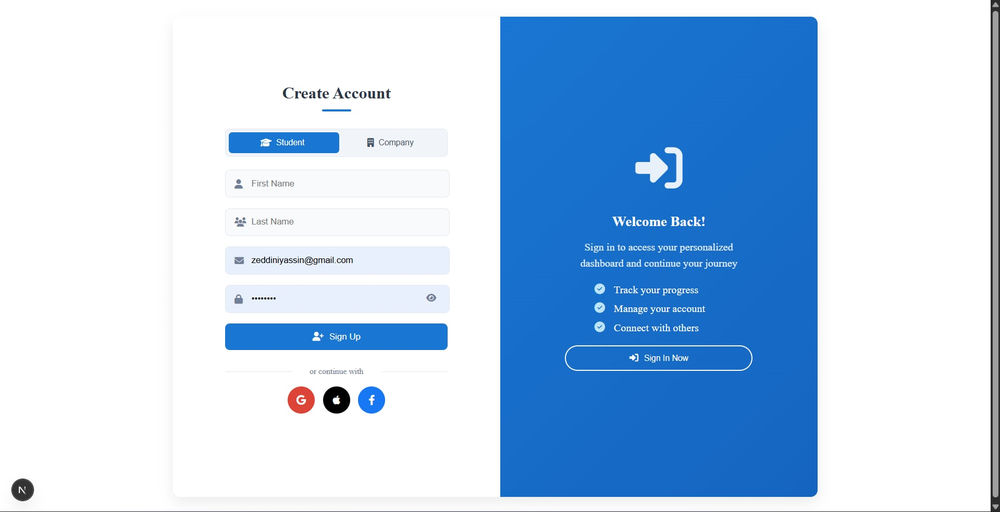

# InTurn – Internship Management Platform

🚀 A full-stack web platform developed to simplify and optimize the internship application and recruitment process for students and companies.

## 📘 Overview

**InTurn** was developed as part of our second-year final project in the **Génie Logiciel** program at **FST El Manar**. The platform aims to bridge the gap between students seeking internships and companies looking for qualified interns by offering a centralized, efficient, and user-friendly solution.

## 🎯 Objectives

- Help students discover and apply to internship opportunities more easily  
- Enable companies to post and manage internship offers  
- Facilitate communication and tracking between both parties  
- Provide a scalable and modern web application with clean UI/UX

## ⚙️ Technologies Used

### Frontend:
- React.js  
- Next.js

### Backend:
- Node.js  
- Express.js

### Database:
- MySQL

### Tools:
- Git & GitHub  
- Postman  
- VS Code

## 🧠 Features

- 🔐 Authentication and role-based access (student/company)  
- 📄 Internship listing, search, and filtering  
- 📝 Application tracking and status updates  
- 📊 Dashboard for users to manage activity  
- 📁 CV upload and profile management for students  


## 📸 Screenshots

<p align="center">


</p>
<p align="center">


</p>
<p align="center">


</p>
<p align="center">


</p>
<p align="center">


</p>


### Prerequisites

- Node.js & npm  
- MySQL Server  
- Git

### Step 1: Clone the Repository

```bash
git clone https://github.com/MontassarBr/InTurn.git
cd InTurn/InTurn_pfa
```

### Step 2: Backend Setup

```bash
cd backend
npm install
```

Create a `.env` file in the `backend` directory with the following content:

```
DB_HOST=localhost
DB_USER=your_mysql_user
DB_PASSWORD=your_mysql_password
DB_NAME=inturn_db
PORT=5000
```

Then run the backend server:

```bash
node src/server
```

### Step 3: Frontend Setup

```bash
cd ../frontend
npm install
npm run dev
```

### Step 4: MySQL Database Setup

* Create a new MySQL database named `inturn_db`
* Import the SQL schema if provided (e.g., `schema.sql`)
* Make sure the credentials match your `.env` configuration

### Step 5: Launch the Application

Visit the application in your browser:

```
http://localhost:3000
```

## 📚 Learning Outcomes

Through this project, we developed strong skills in:

* Full-stack web development
* API design and RESTful architecture
* Database modeling and SQL querying
* Agile development and project management
* UI/UX design principles
* Teamwork and version control with Git

## 🚧 Future Improvements

* Admin dashboard for managing users and offers
* AI-based recommendation system for internship matching
* Notification and messaging features
* Multi-language support (English/French)
* Enhanced performance and responsive design

## 📄 License

This project is intended for academic and learning purposes only.
All rights reserved © 2025.
